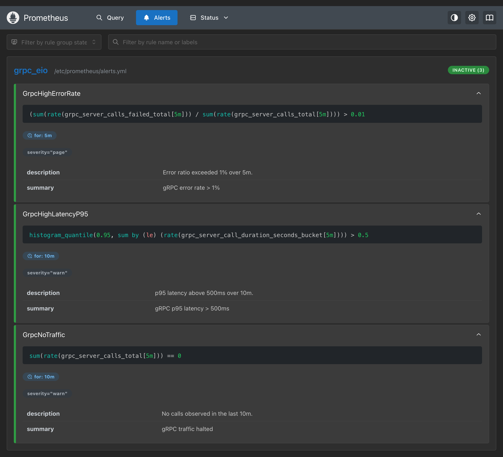
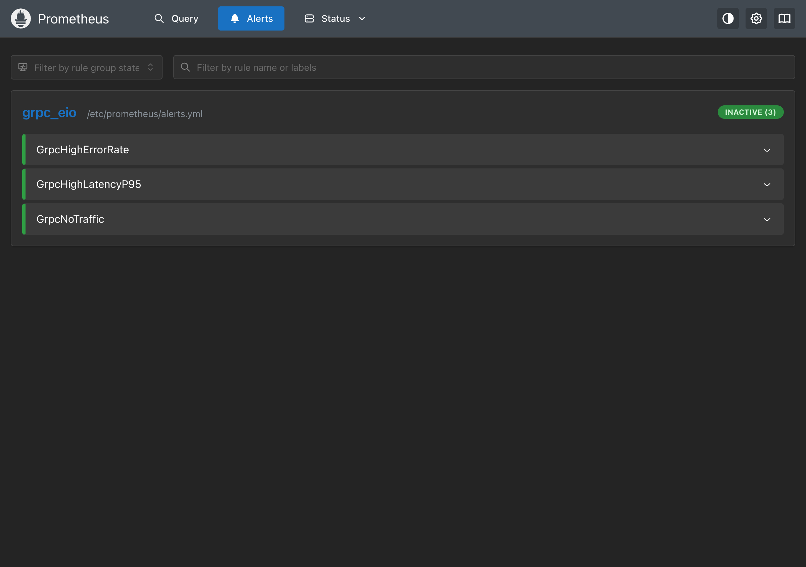
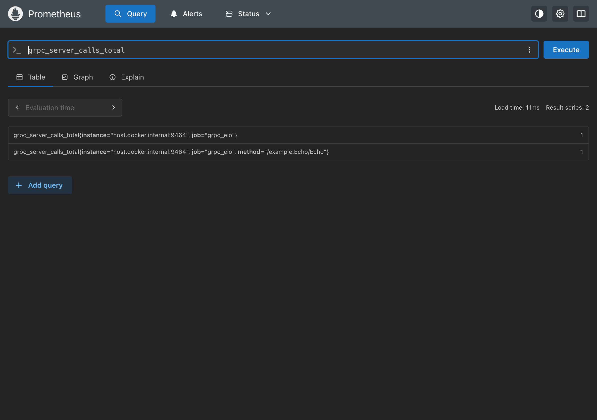
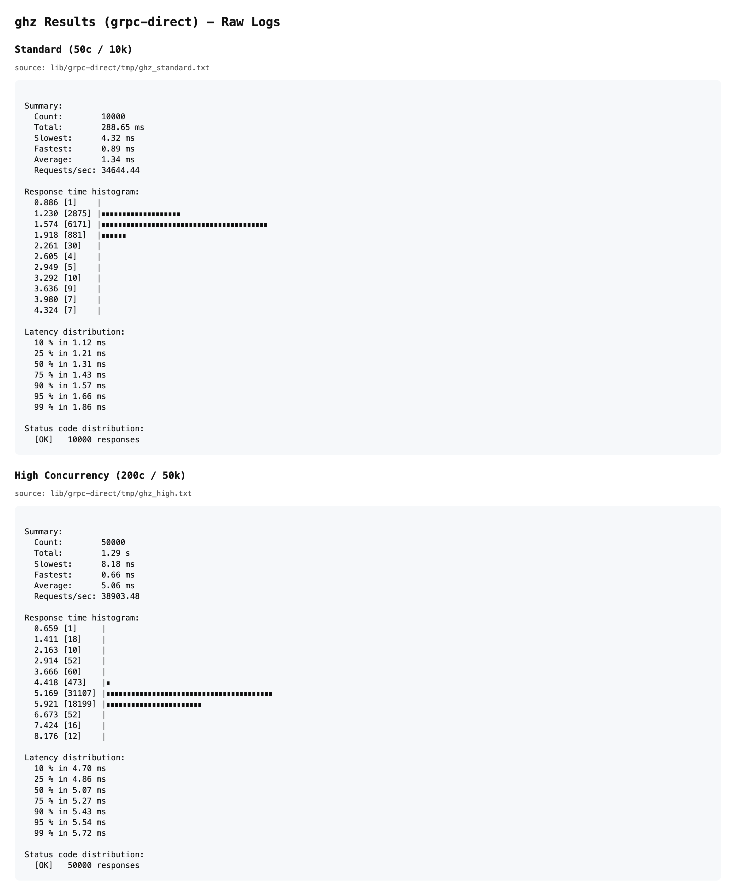
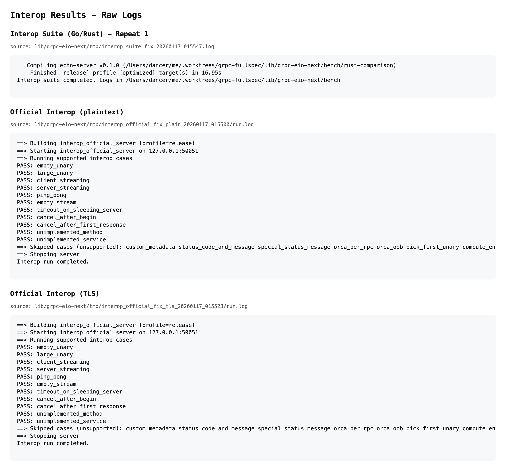

# Production Readiness Report (grpc-eio)

Date: 2026-01-18

Scope: RFC 7540/7541 + gRPC core + gRPC-Web (gateway path for client streaming/bidi).

## Environment / Versions

- OS: Darwin 25.2.0 (arm64)
- OCaml: 5.4.0
- Dune: 3.20.2
- ghz: 0.121.0
- Go: 1.24.1 (grpc-go interop client: google.golang.org/grpc@v1.78.0)
- Rust: 1.92.0

## Summary

- Status: READY (interop + observability + performance baseline + 24h soak)
- Note: browser direct gRPC-Web supports unary/server-streaming only; client-streaming/bidi requires WebSocket gateway.
- PDF: `docs/assets/PROD-READINESS.pdf`

## 1) Interop Suite (Go/Rust clients vs OCaml server)

Run:
```
./bench/run_interop_suite.sh --repeat 1
```

Result: PASS (no FAIL/ERROR)

Log:
- `bench/tmp_interop_*_20260118_031707*.log`

## 2) Official gRPC Interop (grpc-go client)

Plaintext:
```
./bench/run_official_interop.sh
```
Result: PASS

Log:
- `tmp/interop_official_plain/tmp_official_interop_*.log`
- `tmp/interop_official_plain/tmp_official_interop_server.log`

TLS:
```
USE_TLS=1 CERT_FILE=tmp_tls/server.pem KEY_FILE=tmp_tls/server.key \
CA_FILE=tmp_tls/ca.pem SERVER_NAME=localhost \
./bench/run_official_interop.sh
```
Result: PASS

Log:
- `tmp/interop_official_tls/tmp_official_interop_*.log`
- `tmp/interop_official_tls/tmp_official_interop_server.log`

Skipped (unsupported by design):
- custom_metadata, status_code_and_message, special_status_message
- orca_per_rpc, orca_oob, pick_first_unary
- compute_engine_creds, service_account_creds, jwt_token_creds, per_rpc_creds
- oauth2_auth_token, google_default_credentials, compute_engine_channel_credentials

## 3) Observability Verification (Prometheus)

Health:
- Target status: up
- `tmp/prom_targets_verify.json`

Signal:
- grpc_server_calls_total=1
- `tmp/prom_query_calls_verify.json`

Rules:
- GrpcHighErrorRate, GrpcHighLatencyP95, GrpcNoTraffic
- `ops/prometheus/alerts.yml`

Screenshots:
- `docs/assets/prom_targets.png`
- `docs/assets/prom_alerts.png`
- `docs/assets/prom_query_calls.png`
- `docs/assets/ghz_results.png`
- `docs/assets/interop_results.png`







## 4) Performance Baseline (ghz, localhost)

Standard (50c / 10k, h2_lite echo server):
- RPS: 34,644.44
- P50: 1.31 ms, P95: 1.66 ms, P99: 1.86 ms
- `tmp/ghz_standard.txt`

High (200c / 50k, h2_lite echo server):
- RPS: 38,903.48
- P50: 5.07 ms, P95: 5.54 ms, P99: 5.72 ms
- `tmp/ghz_high.txt`

Automation:
```
./ops/perf/run_ghz_baseline.sh
```

Regression thresholds:
- `docs/PERF-BASELINE.md`

## 5) 24h Soak (low load)

Command:
```
CONCURRENCY=10 DURATION_PER_RUN=10s DURATION_SECONDS=86400 \
./ops/soak/run_soak.sh
```

Window:
- Start: 2026-01-16 01:31:06
- End: 2026-01-17 01:31:04

Totals:
- OK: 682,799,327
- Unavailable: 168,977
- Canceled: 845
- Error rate: 0.024865%

Logs:
- `tmp/soak_client.log`
- `tmp/soak_server.log`
- `tmp/soak_runner.log`

Note:
- Unavailable errors are primarily expected at connection close boundaries.

## 6) HTTP/2 Compliance (h2spec)

Run:
```
./ops/compliance/run_h2spec.sh
```

Result: PASS (146/146, see compliance run)

Log:
- `tmp/h2spec_20260118_041420.log`
- `tmp/h2spec_server.log`

## 7) Resilience Gates

Slow reader (flow control):
```
./ops/resilience/run_slow_reader.sh
```

Connection churn (FD leak check):
```
./ops/resilience/run_connection_churn.sh
```

Cancellation (bidi cancel):
```
./ops/resilience/run_cancel.sh
```

Result: PASS (2026-01-18)

Logs:
- `tmp/slow_reader_server.log`
- `tmp/slow_reader_client.log`
- `tmp/connection_churn_server.log`
- `tmp/connection_churn_client.log`
- `tmp/cancel_server.log`
- `tmp/cancel_client.log`

## Evidence Bundle

Logs:
- `bench/tmp_interop_*_20260118_031707*.log`
- `tmp/interop_official_plain/tmp_official_interop_*.log`
- `tmp/interop_official_plain/tmp_official_interop_server.log`
- `tmp/interop_official_tls/tmp_official_interop_*.log`
- `tmp/interop_official_tls/tmp_official_interop_server.log`
- `tmp/prom_targets_verify.json`
- `tmp/prom_query_calls_verify.json`
- `tmp/ghz_standard.txt`
- `tmp/ghz_high.txt`
- `tmp/slow_reader_server.log`
- `tmp/slow_reader_client.log`
- `tmp/connection_churn_server.log`
- `tmp/connection_churn_client.log`
- `tmp/cancel_server.log`
- `tmp/cancel_client.log`
- `tmp/soak_client.log`
- `tmp/soak_server.log`
- `tmp/soak_runner.log`

Screenshots:
- `docs/assets/prom_targets.png`
- `docs/assets/prom_alerts.png`
- `docs/assets/prom_query_calls.png`
- `docs/assets/ghz_results.png`
- `docs/assets/interop_results.png`


## Notable Fix During Validation

- Guarded response start on closed streams to avoid h2 assertion during
  timeout/cancel paths.
